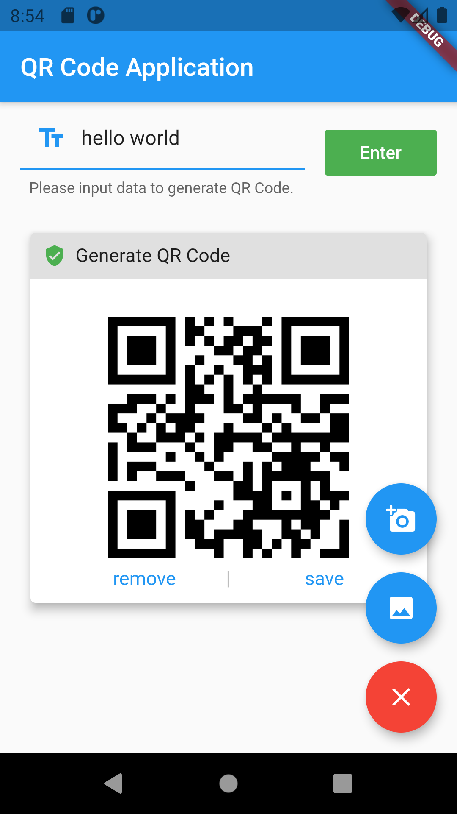

# QR Code Application

This is a QR Code application built with flutter.

## Features

This application contains features including:
1. Scan QR Code with camera on Android
    * Copy generated result
2. Generate QR Code with text data
3. Download the QR code as image file

## Screenshot

